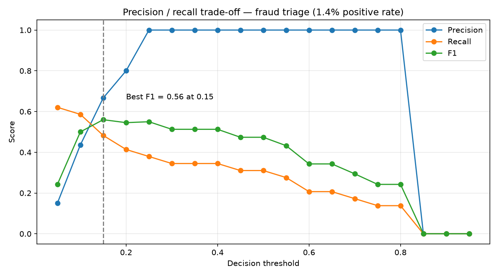

# Fraud Triage API

[](https://github.com/tomtomsatnav/fraud-triage-api/actions/workflows/ci.yml)

A small end-to-end ML service that scores insurance-style claims for fraud risk and
flags the ones worth a human review. It covers the full loop: train a model, track it
in MLflow, promote a version via a registry alias, bake the artefact into a container,
serve it behind FastAPI, log every prediction, and check the live traffic for feature
drift.

The dataset is synthetic (`sklearn.datasets.make_classification`), so the model is a
realistic scaffold rather than a production fraud detector.

---

## Contents

- [Architecture](#architecture)
- [Quickstart](#quickstart)
- [API reference](#api-reference)
- [Configuration](#configuration)
- [Training and the model registry](#training-and-the-model-registry)
- [Prediction logging](#prediction-logging)
- [Drift monitoring](#drift-monitoring)
- [Tests](#tests)
- [Continuous integration](#continuous-integration)
- [Docker](#docker)
- [Project layout](#project-layout)
- [Limitations and trade-offs](#limitations-and-trade-offs)

---

## Architecture

```
train.py ──► MLflow tracking (sqlite:///mlflow.db) ──► Model Registry "fraud-triage"
                                                            │
                                            alias @champion │
                                                            ▼
                                                    export_model.py
                                                            │
                                                            ▼
                                                    model_artifact/   (skops-serialised RF)
                                                            │
                                                            ▼
                             app/main.py  ──►  POST /predict  ──►  logs/predictions.jsonl
                                                                            │
                                                                            ▼
                                                                       monitor.py
                                                                    (z-score drift check)
```

Key design point: the served container does **not** talk to MLflow. The champion
artefact is exported once and copied into the image, so the runtime has no dependency
on the tracking server or `mlflow.db`.

---

## Quickstart

Requires Python 3.12+ (developed on 3.14).

```bash
python -m venv .venv
source .venv/bin/activate          # Windows: .venv\Scripts\activate
pip install -r requirements.txt
```

Run the API against the checked-in model artefact:

```bash
uvicorn app.main:app --reload
```

Then:

```bash
curl http://127.0.0.1:8000/health

curl -X POST http://127.0.0.1:8000/predict \
  -H "Content-Type: application/json" \
  -d '{"features": [3.2, -1.0, 0.3, 2.4, -0.5, 1.4, 4.0, -0.2]}'
```

Interactive docs are at http://127.0.0.1:8000/docs.

---

## API reference

### `GET /health`

Liveness probe. Also reports the threshold the process booted with, which makes it
easy to confirm what a deployed instance is actually using.

```json
{ "status": "ok", "threshold": 0.2 }
```

### `POST /predict`

Scores a single claim.

**Request**

| Field      | Type            | Rules                                  |
|------------|-----------------|----------------------------------------|
| `features` | `list[float]`   | Exactly 8 values, ordered as in training |

```json
{ "features": [3.2, -1.0, 0.3, 2.4, -0.5, 1.4, 4.0, -0.2] }
```

**Response**

```json
{
  "fraud_probability": 0.77,
  "flagged": true,
  "threshold": 0.2
}
```

| Field               | Meaning                                                  |
|---------------------|----------------------------------------------------------|
| `fraud_probability` | `predict_proba` for the positive (fraud) class, 0–1       |
| `flagged`           | `true` when `fraud_probability >= threshold`              |
| `threshold`         | The threshold actually applied, echoed back so a caller can re-derive the decision |

**Errors**

- `422` — `features` missing, or not exactly 8 numbers.

---

## Configuration

Both settings are read from the environment **once at import time**, so a change
requires a process restart.

| Variable          | Default          | Purpose                                                |
|-------------------|------------------|--------------------------------------------------------|
| `FRAUD_THRESHOLD` | `0.2`            | Probability at or above which a claim is flagged        |
| `MODEL_PATH`      | `model_artifact` | Directory holding the MLflow sklearn model to load      |

The threshold is deliberately low. On a ~1.4% fraud base rate the default `0.5` cut-off
buys precision at the cost of recall, and a triage queue would rather over-flag than
miss cases; `train.py` logs precision/recall/F1 at `0.2` so the trade-off is visible
in MLflow.

```bash
FRAUD_THRESHOLD=0.35 uvicorn app.main:app
```

### Where the default comes from

[plot_tradeoff.py](plot_tradeoff.py) sweeps the cut-off from `0.05` to `0.95` and plots
precision, recall, and F1 at each step:

```bash
python plot_tradeoff.py          # writes docs/tradeoff.png
```



F1 peaks at `0.15` (0.56) and is nearly flat through `0.2` (0.55), so the default gives
up a negligible amount of F1 for a slightly cleaner queue. Precision is still climbing
steeply across that range while recall has already begun to fall — which is the argument
for putting the cut-off well below `0.5` rather than a claim that `0.2` is optimal.

The script fits its own `RandomForestClassifier` from the same generator and seed as
`train.py` instead of loading `model_artifact/`, so it shows the shape of the trade-off
for this data rather than measuring the served champion.

---

## Training and the model registry

Tracking and the registry are backed by the SQLite file `mlflow.db` in the repo root.
A database backend is required — the default file store cannot host a model registry.
`train.py` and `export_model.py` talk to that file directly; the UI is only for
browsing and for moving the alias:

```bash
mlflow ui --backend-store-uri sqlite:///mlflow.db
```

Train and register a new version:

```bash
python train.py
```

`train.py` generates a 10,000-row imbalanced classification set (8 features, 4
informative, 99/1 class split), fits a `RandomForestClassifier`, logs the threshold as
a param and precision/recall/F1 at that threshold as metrics, then logs the model
under the registered name `fraud-triage`.

Promote a version by pointing the `champion` alias at it — in the MLflow UI under
**Models → fraud-triage**, or in code:

```python
from mlflow import MlflowClient
MlflowClient("sqlite:///mlflow.db").set_registered_model_alias("fraud-triage", "champion", 6)
```

Export whatever `@champion` currently resolves to into `model_artifact/`:

```bash
python export_model.py
```

The artefact checked in here is **version 6** — the version the `champion` alias
currently resolves to, confirmed by `registered_model_meta` and by the `run_id` in
[model_artifact/MLmodel](model_artifact/MLmodel). It is serialised with `skops`
(`serialization_format: skops`) rather than pickle, which is why `model.skops` is a
zip archive and not a pickle stream. Rolling back is a matter of moving the alias and
re-running the export — no code change.

---

## Prediction logging

Every call to `/predict` appends one JSON object to `logs/predictions.jsonl`:

```json
{"timestamp": "2026-09-03T11:51:57.090818+00:00", "features": [3.2, -1.0, 0.3, 2.4, -0.5, 1.4, 4.0, -0.2], "probability": 0.75, "flagged": true, "threshold": 0.2, "model_alias": "champion"}
```

Recording the features, the threshold, and the model alias alongside the score means a
past decision can be reconstructed even after the champion or the threshold has moved.

`model_alias` is hard-coded to `"champion"` rather than read back from the artefact,
so it records intent rather than fact. See [Limitations](#limitations-and-trade-offs)
for the durability and concurrency caveats.

---

## Drift monitoring

```bash
python monitor.py
```

Rebuilds the training distribution with the same seed, reads the feature vectors out
of `logs/predictions.jsonl`, and for each of the 8 features compares the live mean to
the training mean in units of training standard deviation:

```
feature 0: train  0.02 live  1.31 z= 1.29 ok
feature 3: train -0.01 live  2.40 z= 2.41 DRIFT
```

Anything past `z > 2` is reported as `DRIFT`. This is a deliberately blunt check — a
mean shift only, no distribution shape, no per-feature history, and it needs enough
logged traffic to mean anything. It is a smoke alarm, not a monitoring stack.

---

## Tests

```bash
pytest
```

`pytest.ini` sets `pythonpath = .` so `app` imports without installation. The suite in
[tests/test_api.py](tests/test_api.py) covers the health probe, the shape and range of
a prediction, `422` on the wrong feature count, that the response echoes the threshold
actually applied, and that `flagged` agrees with that threshold. Tests load the real
artefact from `model_artifact/`, so no mocking is involved — and they append to
`logs/predictions.jsonl` as a side effect.

`starlette`'s `TestClient` needs `httpx2` at test time; it is pinned in
`requirements.txt` alongside `pytest` rather than split into a separate dev file, which
does mean both land in the Docker image.

---

## Continuous integration

[.github/workflows/ci.yml](.github/workflows/ci.yml) runs on every push to `main` and
on every pull request:

| Job      | Does                                                                 |
|----------|----------------------------------------------------------------------|
| `test`   | Python 3.12, `pip install -r requirements.txt`, `pytest -v`           |
| `docker` | Builds the image — gated on `test` passing, so a red suite blocks it  |

The suite exercises the real artefact rather than a mock, so a green `test` job also
confirms the model still deserialises on the CI interpreter — which is the check that
matters most when the training and serving Python versions differ.

---

## Docker

```bash
docker build -t fraud-triage-api .
docker run -p 8000:8000 fraud-triage-api
```

Override the threshold at run time:

```bash
docker run -p 8000:8000 -e FRAUD_THRESHOLD=0.35 fraud-triage-api
```

The image copies only `app/` and `model_artifact/`; `.dockerignore` keeps `.venv/`,
`mlruns/`, `mlflow.db`, and `logs/` out.

The base image is `python:3.12-slim` while the artefact was produced under 3.14 — see
`python_version` in [model_artifact/MLmodel](model_artifact/MLmodel). The skops artefact
loads cleanly across that gap and the full suite passes on 3.12, so the mismatch is
recorded rather than a defect; CI pins the same 3.12 so any future divergence shows up
as a failing build rather than a surprise in production.

---

## Project layout

```
app/main.py          FastAPI service: /health, /predict, JSONL logging
train.py             Trains the RF, logs params/metrics, registers "fraud-triage"
export_model.py      Downloads models:/fraud-triage@champion into model_artifact/
monitor.py           Z-score feature-drift check over the prediction log
plot_tradeoff.py     Threshold sweep behind the default cut-off, writes docs/tradeoff.png
tests/test_api.py    API tests against the real artefact
.github/workflows/ci.yml   CI: pytest on 3.12, then a Docker build
model_artifact/      Exported champion (v6, skops) — baked into the image
docs/tradeoff.png    Precision/recall/F1 curve referenced from Configuration
mlruns/, mlflow.db   Local MLflow tracking + registry state
logs/predictions.jsonl   Append-only prediction log
Dockerfile           python:3.12-slim + uvicorn on :8000
```

---

## Limitations and trade-offs

None of these are hidden bugs — they are the conscious edges of a project scoped to
demonstrate the MLOps loop rather than to carry production traffic. Each one has a
known fix; the fix was out of scope.

**The tracking store is not portable.** `mlflow.db` records each version's
`storage_location` as an absolute path (`/Users/tom/fraud-triage-api/mlruns/...`), and
the exported [model_artifact/MLmodel](model_artifact/MLmodel) carries the same absolute
`artifact_path`. The *service* is unaffected — it loads from `MODEL_PATH` as a plain
directory, which is exactly why the artefact is baked into the image — but the registry
itself cannot be moved, mounted into a container, or shared with another machine
without rewriting those paths. Retraining and re-exporting only work from this checkout
at this path. A remote tracking server with an S3 or GCS artifact root is the real fix.

**The prediction log blocks the request.** `/predict` opens, appends to, and closes
`logs/predictions.jsonl` synchronously inside the handler, so every scoring request
pays a filesystem write before it can return. At this volume that is invisible; under
load it puts disk latency directly on the response path, and concurrent workers
appending to one file have no ordering or atomicity guarantees beyond what the OS gives
a single small `write`. Buffered async writes, a queue, or emitting to a log collector
instead of a file would all decouple it.

**Logs do not survive the container.** `logs/` is in `.dockerignore` and nothing mounts
a volume over it, so a containerised instance writes its audit trail into an ephemeral
layer and loses it on exit. The log is only durable in local development.

**Drift is computed from too few rows to be meaningful.** `monitor.py` currently reads
7 logged predictions and compares them against 10,000 training rows. A z-score on a
sample that size is dominated by noise; it will swing past the `z > 2` line on a couple
of unusual claims and say nothing at all about the underlying distribution. The check
is structurally correct and statistically empty until there is real traffic behind it.

**Comparing means only catches shifts, not shape.** The monitor tests one statistic per
feature. A distribution that keeps its mean while doubling its variance, going bimodal,
or growing a fat tail passes cleanly — and those are exactly the shapes that a change in
fraud behaviour tends to produce. A two-sample KS test or a PSI calculation would look
at the whole distribution instead of one moment of it.

**There is no ground truth, so this monitors inputs, not performance.** Nothing in the
loop ever learns whether a flagged claim was actually fraudulent. Feature drift is a
proxy for "the world may have moved", but the questions that matter — has precision
decayed, is the threshold still in the right place, is the model still better than the
rule it replaced — cannot be answered without labels fed back from whoever works the
triage queue. Closing that loop is the single largest gap between this and a real
deployment.

**The model is trained on synthetic data.** The features, their scale, and the 99/1
class balance are artefacts of `make_classification`. The pipeline around the model is
the point; the model itself is a placeholder.

**Operational gaps.** No authentication, rate limiting, or request size limits on
`/predict`. Configuration is read once at import, so a threshold change needs a
restart. The Docker base image and CI both pin `python:3.12` while the artefact was
produced under 3.14; the suite passes across that gap, but training and serving should
still be pinned to one interpreter so the compatibility is guaranteed rather than
observed.

**CI installs the full requirements file.** `requirements.txt` is a flat `pip freeze`
covering runtime, training, and test dependencies together, so CI installs MLflow,
matplotlib, and pandas just to run five API tests, and the Docker image ships `pytest`
and `httpx2` it never uses. Splitting it into `requirements.txt` /
`requirements-dev.txt` would cut both the CI time and the image size.
